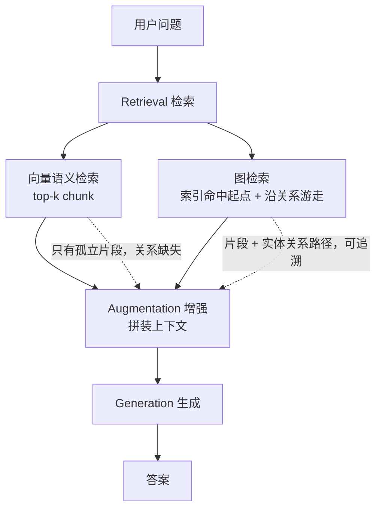

向量 RAG 的天花板，从来不是 Embedding 模型不够强，而是**它抓到的是「片段」，丢掉的却是「关系」**。

这是 Neo4j 官方那篇被引用最多的 GraphRAG 定义文章。它做的事情很朴素：先把 RAG 拆成三个阶段讲清楚，然后指出纯向量检索的两大软肋（片段化 + 黑盒不可解释），再给出解法——把知识图谱当作 LLM 的「外部记忆」，用**图检索**补上关系这一层。文章后半段还带了一个完整的 Neo4j 实战：用 `SimpleKGPipeline` 从生物医学论文 PDF 里抽出实体和关系，再用 `VectorCypherRetriever` 做「向量命中 + 关系跳两跳」，最后和纯向量 RAG 的答案做对比。

原文发布于 2026 年 3 月 24 日，作者是 Neo4j 产品创新与开发者战略负责人 Michael Hunger。翻译之外，我在第二部分补了几个文章一笔带过但工程上很关键的点：多跳问题到底卡在哪、8 类 Retriever 该怎么选、Text2Cypher 为什么被高估、以及 GraphRAG 真正的代价。

> **翻译体例说明**：英文原文以引用块（`>`）呈现，中文译文作为普通段落紧随其后。代码、表格按原文保留，图片已转存至本博客图床。译文尽量贴近原文语序，便于对照；对原文中略显笼统的表述，在解读部分单列讨论。

<!--more-->

## 文章信息

| 项目 | 内容 |
| --- | --- |
| 标题 | What is GraphRAG? |
| 作者 | Michael Hunger |
| 职位 | Head of Product Innovation & Developer Strategy, Neo4j |
| 机构 | Neo4j |
| 发布日期 | 2026 年 3 月 24 日 |
| 阅读时长 | 约 12 分钟 |
| 原文链接 | https://neo4j.com/blog/genai/what-is-graphrag/ |

---

## 第一部分 · 全文翻译（中英对照）

### 引言

> GraphRAG is a powerful retrieval mechanism that improves GenAI applications by taking advantage of the rich context in graph data structures.

GraphRAG 是一种强大的检索机制，它借助图数据结构中丰富的上下文信息来改进生成式 AI（GenAI）应用。

> Enterprise GenAI systems face a critical challenge: the need for trustworthy and reliable results. Pure large language model (LLM)-based solutions often fall short in this regard. These models are trained to prioritize helpfulness over factuality, and their pre-training data usually lacks crucial recent and relevant information. Consequently, they are prone to generating hallucinations of facts and explanations, which is particularly damaging in high-value business domains and use cases.

企业级 GenAI 系统面临一个关键挑战：结果必须可信、可靠。而纯粹基于大语言模型（LLM）的方案在这方面往往力不从心。这类模型的训练目标是优先保证「有用」，而非「真实」；同时它们的预训练数据通常缺少关键的近期信息和相关背景。因此，它们很容易在事实和解释上产生幻觉——在高价值业务领域和场景中，这种错误的破坏力尤其大。

> To address these issues, Retrieval-Augmented Generation (RAG) architectures have emerged as a solution. RAG improves the reliability of GenAI components by ensuring that LLM answers are based only on accurate information from existing knowledge sources.

为解决这些问题，检索增强生成（RAG）架构应运而生。RAG 通过确保 LLM 的回答只基于现有知识源中的准确信息，提升了 GenAI 组件的可靠性。

> Basic RAG systems rely solely on semantic search in vector databases to retrieve and rank sets of isolated text fragments. While this approach can surface some relevant information, it fails to capture the context connecting these pieces. For this reason, basic RAG systems are ill-equipped to answer complex, multi-hop questions.

基础版 RAG 系统仅依赖向量数据库中的语义搜索，来检索并排序一组组彼此孤立的文本片段。这种方式虽然能捞出一些相关信息，却捕捉不到把这些片段连接起来的上下文。正因如此，基础 RAG 系统难以胜任复杂的多跳（multi-hop）问题。

> This is where GraphRAG comes in. It uses knowledge graphs to represent and connect information to capture not only more data points but also their relationships. Thus, graph-based retrievers can provide more accurate and relevant results by uncovering hidden connections that aren't often obvious but are crucial for correlating information.

这正是 GraphRAG 的用武之地。它用知识图谱来表达并连接信息，不仅能捕获更多的数据点，还能捕获它们之间的关系。于是，基于图的检索器能够挖掘出那些通常并不显眼、却对串联信息至关重要的隐藏连接，从而给出更准确、更相关的结果。

> In this blog post, we'll dive into how GraphRAG works, explore its advantages over other RAG architectures in improving answer quality and explainability, and demonstrate its practical application using a Neo4j example.

在这篇文章中，我们将深入探讨 GraphRAG 的工作原理，剖析它在提升答案质量和可解释性方面相比其他 RAG 架构的优势，并通过一个 Neo4j 示例演示它的实际应用。

### 检索增强生成（RAG）入门

> Before diving into the specifics of GraphRAG, it's essential to understand the basic concepts of RAG. Let's take a closer look at the three key phases of RAG:

在深入 GraphRAG 的细节之前，有必要先理解 RAG 的基本概念。让我们仔细看看 RAG 的三个关键阶段：

> **Retrieval:** In this phase, the RAG system retrieves relevant information from external data sources, such as documents or databases, based on the user's query. The retrieval process can use different techniques to identify the most pertinent data, such as similarity searches or database queries. The results are then ranked and scored based on their relevance to the query.

**检索（Retrieval）：** 在这一阶段，RAG 系统根据用户的查询，从文档或数据库等外部数据源中检索相关信息。检索过程可以使用多种技术来找出最相关的数据，例如相似度搜索或数据库查询。随后，结果会依据与查询的相关性被打分并排序。

> **Augmentation:** During the augmentation phase, the retrieved information is combined with the original user question, along with any additional instructions or context. This augmented prompt provides a richer context for the language model to generate a response. The goal is to force the model to only use this relevant information to produce an accurate and useful output.

**增强（Augmentation）：** 在增强阶段，检索到的信息会与用户原始问题、以及任何附加指令或上下文合并在一起。这个被增强过的 prompt 为语言模型提供了更丰富的上下文。其目的是强制模型只使用这些相关信息，来产出准确且有价值的结果。

> **Generation:** In the final phase, the augmented prompt is processed by an LLM, which generates an answer in a requested format using only the provided context rather than relying on its pre-trained knowledge. The response can also link source information and additional metadata.

**生成（Generation）：** 在最后阶段，增强后的 prompt 交由 LLM 处理，模型仅依据所提供的上下文——而不是依赖其预训练知识——生成指定格式的答案。响应中还可以附带来源信息和额外的元数据。

> By augmenting the language model with external knowledge and using the model's natural language understanding capabilities to retrieve and process this information, RAG systems can produce more accurate and informative responses compared to standalone language models that rely solely on their pre-trained knowledge.

通过用外部知识增强语言模型，并利用模型自身的自然语言理解能力去检索和处理这些信息，RAG 系统能够产出比「仅依赖预训练知识」的独立语言模型更准确、信息量更丰富的响应。


### 纯向量 RAG 的局限

> Many baseline RAG systems rely solely on vector search over text embeddings (numerical vector representations) for information retrieval. To accurately capture the cohesive semantic meaning of a piece of text, the source documents are often chunked into smaller fragments, which are then embedded, indexed, and stored for retrieval.

许多基线 RAG 系统在信息检索时，仅依赖对文本嵌入（embedding，即文本的数值向量表示）的向量搜索。为了准确捕获一段文本整体的语义含义，源文档往往会被切分成更小的片段（chunk），然后对这些片段做嵌入、建索引并存储，以供检索使用。

> However, this approach has its limitations. By relying solely on vector search, the response's content is confined to the text fragments in the retrieved chunks. This can lead to incomplete or fragmented answers.

然而，这种做法有其局限。仅依赖向量搜索，意味着回答的内容被束缚在检索到的那些 chunk 的文本片段里。这会导致答案不完整或支离破碎。

> For example, if a user asks a question about a specific product feature, a vector-only RAG system might retrieve chunks that mention the product but fail to include relevant information from other parts of the documentation that provide a more comprehensive answer.

举个例子：如果用户问的是某个具体产品特性，纯向量 RAG 系统可能只捞到提及该产品的那些 chunk，却漏掉了文档其他位置本该纳入、能让答案更完整的相关信息。

> Moreover, due to the black-box nature of vector representations and vector search, such methods cannot explain the sources of the gathered information. This means that users and developers have limited visibility into why certain chunks were retrieved and how they contribute to the generated response. This lack of explainability can be a significant drawback, particularly in domains where transparency and accountability are crucial, such as healthcare or finance.

更进一步，由于向量表示和向量搜索的「黑盒」特性，这类方法无法解释所收集信息的来源。这意味着用户和开发者很难看清：为什么某些 chunk 会被检索到，以及它们如何影响了最终生成的回答。这种可解释性的缺失可能是一个重大缺陷，在医疗、金融等对透明度和可问责性要求极高的领域尤其如此。

> To address these shortcomings, new techniques are emerging to improve different phases of the RAG process (retrieval, augmentation, and generation).

为弥补这些不足，业界正在涌现各种新技术，用来改进 RAG 流程的不同阶段（检索、增强、生成）。

> Since the information provided to the LLM is crucial to answer quality, improving the retrieval mechanism often has the most significant impact. GraphRAG is a common approach to enhance retrieval by incorporating structured domain knowledge stored in a knowledge graph. By tapping into the rich connections and semantic relationships in a knowledge graph, GraphRAG aims to overcome the limitations of vector-only RAG and provide more accurate and explainable responses.

由于提供给 LLM 的信息对答案质量至关重要，改进检索机制往往能带来最显著的收益。GraphRAG 就是一种常见做法：把存放在知识图谱里的结构化领域知识纳入检索流程，以此增强检索。通过挖掘知识图谱中丰富的连接和语义关系，GraphRAG 旨在克服纯向量 RAG 的局限，给出更准确、也更可解释的响应。

### 用知识图谱表达数据

> A knowledge graph model is especially suitable for representing structured and unstructured data with connected elements. Unlike traditional databases, they don't require a rigid schema but are more flexible in the data model. The graph model allows efficient storage, management, querying, and processing of the richness of real-world information. In a RAG system, the knowledge graph serves as the flexible memory companion to the language skills of LLMs, such as summarization, translation, and extraction.

知识图谱模型特别适合表达那些「元素之间存在连接」的结构化和非结构化数据。与传统数据库不同，它不需要刚性的 schema，数据模型更灵活。图模型能够高效地存储、管理、查询和处理现实世界信息的丰富性。在 RAG 系统中，知识图谱充当 LLM 语言能力（如摘要、翻译、抽取）的「灵活记忆」搭档。


> In a knowledge graph, facts and entities are represented as nodes with attributes connected with typed relationships, which also carry attributes for qualification. This graph model can scale from a simple family tree to the complete digital twin of a company encompassing employees, customers, processes, products, partnerships, and resources, with millions or billions of connections.

在知识图谱中，事实和实体被表示为带属性的节点，节点之间通过**有类型的关系（typed relationship）**相连，关系本身同样携带属性以作限定。这个图模型的可扩展范围，从一个简单的家谱，一直到一个企业的完整数字孪生——涵盖员工、客户、流程、产品、合作伙伴和资源，连接数可达数百万乃至数十亿。

> Graph structures can originate from various sources, from a structured business domain, (hierarchical) document representations, and signals computed by graph algorithms.

图结构可以来自多种来源：结构化的业务领域数据、（层次化的）文档表示，以及由图算法计算出来的信号。

### 面向 GraphRAG 检索器的图查询

> Graphs can be navigated (traversed) by following simple patterns like `(node:Type)-[relationship:TYPE]->(node:Type)` or more complex variants expressed in Graph query languages like Cypher or GQL. Pattern matching results in paths whose nodes, relationships, and attributes can be filtered, aggregated, and sorted like in other query languages like SQL.

图谱可以通过追踪简单的模式来导航（遍历），比如下面这种「节点—关系—节点」的写法，也可以用 Cypher 或 GQL 等图查询语言表达更复杂的变体：

```
(node:Type)-[relationship:TYPE]->(node:Type)
```

模式匹配会得到若干路径，路径上的节点、关系和属性都可以像 SQL 等其他查询语言那样做过滤、聚合和排序。下面这个图查询示例，会从一次向量嵌入搜索出发，返回邻域信息：

```cypher
CALL db.index.vector.queryNodes(docs, 5, $embedding) yield node as doc, score
RETURN score, doc, COLLECT {
    MATCH path = (doc)-[rel]-(neighbor)
    RETURN path
} as paths
ORDER BY score DESC LIMIT 10
```

### GraphRAG 如何改进检索

> A GraphRAG retrieval can find starting points in this network of data via vector, fulltext, spatial, or other searches and then follow relevant relationships to gather additional information to satisfy the user queries. The context of the user and task is considered to increase relevance. All captured nodes, relationships and their attributes can be filtered and ranked before being returned as context in the augmentation phase.

一次 GraphRAG 检索，可以先通过向量、全文、空间或其他搜索，在这个数据网络中找到若干起点，然后沿相关关系继续游走，收集更多信息来满足用户查询。过程中会考虑用户与任务的上下文以提升相关性。所有被捕获的节点、关系及其属性，都可以先经过过滤和排序，再作为增强阶段的上下文返回。


> This approach offers several advantages over vector-only RAG systems:

相比纯向量 RAG 系统，这种做法有几项优势：

> - By navigating the graph structure and following relevant relationships, GraphRAG can retrieve information that may not be directly mentioned in the initial set of retrieved chunks, providing a more comprehensive and contextually relevant response.
> - The ability to filter and rank the retrieved information based on the user's context and task allows GraphRAG to prioritize the most pertinent information, improving the overall quality of the generated response.
> - GraphRAG enables better explainability by capturing the relationships between the retrieved information, making it easier to trace the sources and reasoning behind the generated response.
> - By using the knowledge graph's ability to integrate structured and unstructured data, as well as computed signals, GraphRAG can provide more informed and nuanced responses that draw from a wider range of information sources.

- 通过在图结构上游走、沿相关关系追踪，GraphRAG 能检索到初始召回的 chunk 集合中未被直接提及的信息，从而给出更完整、在上下文上更贴切的响应。
- 依据用户上下文和任务对检索到的信息做过滤与排序，使 GraphRAG 能优先使用最相关的信息，提升生成响应的整体质量。
- GraphRAG 捕获了被检索信息之间的关系，因而具备更好的可解释性，让生成响应的来源与推理链路更容易被追溯。
- 借助知识图谱整合结构化数据、非结构化数据以及计算得出的信号的能力，GraphRAG 能够从更广泛的信息来源中取材，给出更有依据、更细腻的响应。

> These improvements in the retrieval phase contribute to GraphRAG's ability to generate more accurate, relevant, and traceable responses compared to vector-only RAG systems.

这些在检索阶段的改进，使 GraphRAG 相比纯向量 RAG 系统，能够生成更准确、更相关、也更可追溯的响应。

### GraphRAG 检索器的类型

> The actual graph retrieval depends on the use case and domain. Different types of retrievers can be combined, and their results ranked, combined, or sequenced. In an agentic setup, retrievers can become tools that the LLM selects and runs iteratively, passing parameters and results until the necessary information to answer the question is collected.

具体采用哪种图检索，取决于用例和领域。不同类型的检索器可以组合使用，其结果可以排序、合并或按顺序串联。在 Agentic（智能体化）的设定下，检索器可以成为工具，由 LLM 选择并迭代执行，不断传递参数和结果，直到收集齐回答问题所需的信息。

> Examples of GraphRAG retriever types include:

GraphRAG 检索器的类型示例包括：

> - **Vector (Embedding), Fulltext, Spatial, or other Search Indexes:** Using index searches with information from the user question to determine starting points in the graph for further exploration.
> - **Neighborhood Traversal:** Access direct or indirect neighbors of a node to put a piece of information into context.
> - **Path Traversals:** Find paths between starting entities, expand relationships to their neighborhood, and retrieve additional related documents, claims, and other entities.
> - **Global Queries:** Using pre-computed, cross-topic summarization and other global representations of insights to answer general questions (see Microsoft's GraphRAG with Query Focused Summarization).
> - **Query Templates:** Use case-specific queries for categories of questions are provided by a domain expert, can have the same starting points but explore different sub-graphs, and can be selected by categorizing questions.
> - **Dynamic Cypher Generation (Text2Cypher):** A (fine-tuned) LLM generates a Cypher query from the user question and the graph schema description to answer specific and structural questions.
> - **Agentic Traversal:** Using different retrievers, an LLM selects and executes them in a planned sequence to collect all information to answer the question.
> - **Graph Embedding Retrievers:** Using embeddings to represent the "essence" of a node's neighborhood and allow fuzzy topological search by matching candidate embeddings.

- **向量（嵌入）、全文、空间或其他搜索索引**：用索引搜索加上用户问题中的信息，确定图上的起点，以便进一步探索。
- **邻域遍历（Neighborhood Traversal）**：访问某个节点的直接或间接邻居，把一条信息放回上下文中。
- **路径遍历（Path Traversals）**：找出起始实体之间的路径，把关系扩展到其邻域，并检索更多相关文档、主张（claim）和其他实体。
- **全局查询（Global Queries）**：使用预计算的跨主题摘要等全局性洞察表示，来回答通用性问题（参见微软 GraphRAG 的 Query Focused Summarization）。
- **查询模板（Query Templates）**：由领域专家针对某几类问题提供用例专属查询；这些查询可以有相同的起点，但探索不同的子图，并可通过给问题分类来选择。
- **动态 Cypher 生成（Text2Cypher）**：由一个（微调过的）LLM 根据用户问题和图 schema 描述生成 Cypher 查询，用来回答具体的、结构性的问题。
- **Agentic 遍历（Agentic Traversal）**：LLM 使用不同的检索器，按规划好的顺序选择和执行它们，收集齐回答该问题所需的全部信息。
- **图嵌入检索器（Graph Embedding Retrievers）**：用嵌入来表示一个节点邻域的「本质」，并通过匹配候选嵌入实现模糊的拓扑搜索。

> You can find more examples in the GraphRAG Pattern Catalog on graphrag.com.

更多示例可以在 graphrag.com 的 GraphRAG Pattern Catalog 中找到。

### 知识图谱的构建

> For GraphRAG to work well, we need to ensure that our data has a shape that accurately represents the highly relevant, connected pieces of information. To create this knowledge graph, we need to follow two steps, which can be repeated for refinement:

要让 GraphRAG 发挥好效果，我们需要确保数据的形态能够准确表达那些高度相关、彼此连接的信息。构建这张知识图谱需要遵循两个步骤，并且可以反复迭代以持续优化：

> - Model the relevant nodes and relationships to represent our domain data.
> - Import, create, or compute the graph structures to fit this graph model.

- 对相关的节点和关系建模，以表达我们的领域数据。
- 导入、创建或计算图结构，使其适配这个图模型。


> We can combine different sources of data:

我们可以组合不同的数据来源：

> - Import existing structured data from databases, files or APIs.
> - Turn unstructured data (text, audio, video) into a graph representation of document structures/hierarchies and add vector embeddings and full-text indexes for chunks.
> - Construct or connect structured entities (with optional embeddings) and their relationships from textual information.
> - Enhance existing graphs with additional computation or algorithms, such as topic-clustering summaries (like in Microsoft Query Focused Summarization), similarity relationships, and personalized page rank (PPR) scores.

- 从数据库、文件或 API 导入已有的结构化数据。
- 把非结构化数据（文本、音频、视频）转成文档结构／层次 的图表示，并为 chunk 添加向量嵌入和全文索引。
- 从文本信息中构建或连接结构化实体（可选带嵌入）及其关系。
- 用额外的计算或算法增强已有的图，例如主题聚类摘要（如微软的 Query Focused Summarization）、相似度关系，以及个性化 PageRank（PPR）分数。

> These graph models and sources are also described in more detail in the GraphRAG pattern catalog.

这些图模型和数据来源在 GraphRAG 模式目录（pattern catalog）中也有更详细的描述。

### 一个 Neo4j 的 GraphRAG 实战示例

> A frequent use case for GraphRAG is analyzing research information in more detail than just "chatting with your PDF." In a vector-only semantic search approach, the data returned from the retrievers are just scored chunks of text with little or no information on how they relate to concepts from the domain or each other.

GraphRAG 一个常见的用例，是比「和你的 PDF 聊天」更细致地分析研究信息。在纯向量的语义搜索方案里，检索器返回的数据只是一些被打过分的文本 chunk，几乎没有（甚至完全没有）信息说明它们与领域概念、或彼此之间是什么关系。

> In contrast, a GraphRAG approach allows us to extract entities such as Person, Organization, Article, Paper, BiologicalProcess, Condition, Disease, Drug, Gene, Expression, Exposure, and Pathway that appear in our documents and create a rich network of information.

相比之下，GraphRAG 方案允许我们从文档中抽取出 Person、Organization、Article、Paper、BiologicalProcess、Condition、Disease、Drug、Gene、Expression、Exposure、Pathway 等实体，并构建出一张丰富的信息网络。

> To demonstrate this, let's walk through an example of constructing a knowledge graph using the open source neo4j-graphrag package. You can also use LangChain, LlamaIndex, or other integrations.

为演示这一点，让我们走一遍用开源 `neo4j-graphrag` 包构建知识图谱的示例。你也可以使用 LangChain、LlamaIndex 或其他集成方案。

> In this example, we use the SimpleKGPipeline, which comes with a number of defaults and executes the steps depicted below:

在这个示例中，我们使用 `SimpleKGPipeline`，它自带一系列默认配置，并会执行下图所示的步骤：


> To run this extraction, we configure the Pipeline with the following components:

要运行这次抽取，我们需要为 Pipeline 配置以下几个组件：

> - LLM (e.g., gpt-4o-mini from OpenAI)
> - Embedding model
> - Document splitter
> - Graph schema

- LLM（例如 OpenAI 的 gpt-4o-mini）
- 嵌入模型（Embedding model）
- 文档切分器（Document splitter）
- 图 schema（Graph schema）

> Once configured, we can execute the pipeline on our dataset of biomedical research papers:

配置完成后，我们就可以在一批生物医学研究论文数据集上执行这个 pipeline：

```python
driver = neo4j.GraphDatabase.driver(NEO4J_URI, auth=(NEO4J_USERNAME, NEO4J_PASSWORD))

ex_llm=OpenAILLM(
    model_name="gpt-4o-mini",
    model_params={
        "response_format": {"type": "json_object"},
        "temperature": 0
    }
)
embedder = OpenAIEmbeddings()

node_labels = ["Anatomy", "BiologicalProcess", ...]
rel_types = ["ACTIVATES", "AFFECTS", "ASSESSES",...,"TREATS", "USED_FOR"]

kg_builder_pdf = SimpleKGPipeline(
    llm=ex_llm,
    driver=driver,
    text_splitter=FixedSizeSplitter(chunk_size=500, chunk_overlap=100),
    embedder=embedder,
    entities=node_labels,
    relations=rel_types,
    prompt_template=prompt_template,
    from_pdf=True
)

pdf_file_paths = [
    'biomolecules-11-00928-v2.pdf',
    'GAP-between-patients-and-clinicians_2023_Best-Practice.pdf',
    'pgpm-13-39.pdf'
]

for path in pdf_file_paths:
    graph_data = await kg_builder_pdf.run_async(file_path=path)
```

> After storing the chunked document data and graph data in Neo4j, we can visualize it using our Query tool.

把切分后的文档数据和图数据存入 Neo4j 之后，我们可以用 Query 工具把它可视化出来。


> Now, we can execute a GraphRAG retriever and compare its results with a vector RAG retriever.

现在，我们可以运行一个 GraphRAG 检索器，并把结果与向量 RAG 检索器做对比。

> This retriever first executes a vector search for the indexed text chunks and then follows non-chunk relationships up to 2 hops out, retrieving not only the directly extracted entities but also their first- and second-degree neighbors. It returns the chunk texts and entity-relationship-entity pairs as context for use in the final phases of prompt augmentation and answer generation.

这个检索器会先对已建索引的文本 chunk 执行一次向量搜索，然后沿非 chunk 关系向外追踪最多 2 跳，不仅取回直接抽取出的实体，还包括它们的一度和二度邻居。它返回 chunk 文本以及「实体-关系-实体」三元组作为上下文，供后续的 prompt 增强和答案生成阶段使用。

```python
from neo4j_graphrag.retrievers import VectorCypherRetriever

graph_retriever = VectorCypherRetriever(
    driver,
    index_name="text_embeddings",
    embedder=embedder,
    retrieval_query="""
//1) Go out 2-3 hops in the entity graph and get relationships
WITH node AS chunk
MATCH (chunk)<-[:FROM_CHUNK]-(entity)-[relList:!FROM_CHUNK]-{1,2}(nb)
UNWIND relList AS rel

//2) collect relationships and text chunks
WITH collect(DISTINCT chunk) AS chunks, collect(DISTINCT rel) AS rels

//3) format and return context
RETURN apoc.text.join([c in chunks | c.text], '\n') +
    apoc.text.join([r in rels |
        startNode(r).name+' - '+type(r)+' '+r.details+' -> '+endNode(r).name],
        '\n') AS info
"""
)
```

> Next, we build the vector and GraphRAG pipelines using each retriever with a suitable LLM (here, using the better OpenAI gpt-4o) and prompt for question answering:

接下来，我们用各自的检索器分别搭建向量 pipeline 和 GraphRAG pipeline，配合一个合适的 LLM（这里用的是更强的 OpenAI gpt-4o）以及用于问答的 prompt：

```python
llm = LLM(model_name="gpt-4o", model_params={"temperature": 0.0})

rag_template = RagTemplate(template='''Answer the Question using the following Context. Only respond with information mentioned in the Context. Do not inject any speculative information not mentioned.

# Question:
{query_text}

# Context:
{context}

# Answer:
''', expected_inputs=['query_text', 'context'])

vector_rag = GraphRAG(llm=llm, retriever=vector_retriever, prompt_template=rag_template)

graph_rag = GraphRAG(llm=llm, retriever=graph_retriever, prompt_template=rag_template)

q = "Can you summarize systemic lupus erythematosus (SLE)? including common effects, biomarkers, and treatments? Provide in detailed list format."

vector_rag.search(q, retriever_config={'top_k':5}).answer
graph_rag.search(q, retriever_config={'top_k':5}).answer
```

> The comparison of answers shows that the GraphRAG response is much more comprehensive and covers more of the relevant context.

答案对比显示，GraphRAG 的响应要全面得多，覆盖了更多相关上下文。


> For more details, see GraphRAG Python Package: Accelerating GenAI With Knowledge Graphs and check out the resources section.

更多细节参见《GraphRAG Python Package: Accelerating GenAI With Knowledge Graphs》，并查看下方的资源列表。

### GraphRAG 的常见用例

> GraphRAG is used in applications and domains that require a higher level of trust, as their outputs are used for critical business decision-making. Some examples include:

GraphRAG 被用在那些对可信度要求更高、其输出会被用于关键业务决策的应用和领域中。示例如下：

> - **Legal and Compliance:** Reviewing and analyzing contracts, cases, laws, and regulations.
> - **Investment Research:** Investigating organizations, people, competitors, markets, and trends.
> - **Biotech:** Accessing knowledge graphs for drug discovery and repurposing, clinical trials, and research.
> - **Business Process Support:** Integrating various business data sources into a cohesive view of an organization.
> - **Supply Chain:** Conducting investigations for risk assessment, compliance, and sustainability of products and production processes.
> - **Fraud Detection:** Identifying and preventing money laundering (AML), insurance fraud, and other fraudulent activities.
> - **Investigative Journalism:** Uncovering connections and patterns in large datasets for news stories and investigations.
> - **Natural Language Search and Chatbots:** Democratizing access to pre-existing knowledge bases through user-friendly interfaces.

- **法律与合规**：审阅和分析合同、案件、法律与法规。
- **投资研究**：调查机构、人物、竞争对手、市场与趋势。
- **生物科技**：访问知识图谱以支持药物发现与老药新用、临床试验和研究。
- **业务流程支持**：把各类业务数据源整合成组织的统一视图。
- **供应链**：针对产品与生产流程的风险评估、合规性和可持续性开展调查。
- **欺诈检测**：识别并防范洗钱（AML）、保险欺诈及其他欺诈活动。
- **调查性新闻**：在大型数据集中挖掘关联与模式，服务于新闻报道和调查。
- **自然语言搜索与聊天机器人**：通过易用的交互界面，让既有知识库的访问「平民化」。

### GraphRAG：支撑企业级 AI 应用

> RAG architectures are currently the most effective way to provide reliable content for GenAI business applications by using data from trusted data sources. GraphRAG takes this a step further, improving upon basic vector-based RAG in both quality and explainability.

目前，RAG 架构是通过可信数据源为 GenAI 业务应用提供可靠内容的最有效方式。GraphRAG 则更进一步，在质量和可解释性两方面都超越了基础的向量 RAG。

> By considering more relevant context and using a variety of retrievers that navigate document, domain, and computed graph structures, GraphRAG delivers more accurate, trustworthy, and traceable results. The combination of knowledge graphs, with their rich representation of real-world information, and LLMs, with their advanced language skills, creates a robust and reliable solution for enterprise use cases.

通过纳入更多相关上下文，并使用多种检索器去游走文档结构、领域结构和计算得到的图结构，GraphRAG 交付的是更准确、更可信、更可追溯的结果。知识图谱对现实世界信息的丰富表达，加上 LLM 先进的语言能力，两者结合为企业用例提供了健壮而可靠的解决方案。

> As more organizations adopt GenAI, GraphRAG will be essential in ensuring the accuracy, reliability, and transparency of these systems, paving the way for better decision-making and improved business outcomes.

随着越来越多的组织采用 GenAI，GraphRAG 将在确保这些系统的准确性、可靠性和透明度方面变得必不可少，为更好的决策和更优的业务结果铺平道路。

> ### Design a RAG solution that handles complex questions
>
> AI engineers explain how to combine structured and unstructured data for production-ready RAG.
>
> Download guide

#### 设计一个能应对复杂问题的 RAG 方案

AI 工程师讲解如何为生产级 RAG 整合结构化与非结构化数据。

下载指南


### 更多资源

> If you want to learn more about GraphRAG, check out these resources:

如果你想进一步了解 GraphRAG，可以看看这些资源：

> **Overviews**
>
> - GraphRAG Manifesto
> - What is a Knowledge Graph
> - Generative AI with Neo4j

**概览类**

- GraphRAG Manifesto
- What is a Knowledge Graph
- Generative AI with Neo4j

> **Technical**
>
> - GraphRAG Pattern Catalog
> - Online Neo4j LLM Knowledge Graph Builder (using LangChain)
> - Neo4j GraphRAG Python Package

**技术类**

- GraphRAG Pattern Catalog
- Online Neo4j LLM Knowledge Graph Builder（基于 LangChain）
- Neo4j GraphRAG Python Package

> **Courses**
>
> - DeepLearning.AI Knowledge Graphs for RAG course
> - Free GraphAcademy GenAI courses

**课程类**

- DeepLearning.AI 的 Knowledge Graphs for RAG 课程
- 免费的 GraphAcademy GenAI 课程

---

## 第二部分 · 解读

### 一、这篇文章真正在讲什么

把 Neo4j 这篇文章的论证链抽出来，其实只有三步：

1. LLM 会幻觉，因为它的训练目标优先「有用」而非「真实」，且预训练数据缺近期信息；
2. RAG 能治幻觉，但**基础 RAG 把问题换成了另一个问题**——它只在向量库里做语义搜索，抓到的是孤立的 chunk；
3. 孤立 chunk 缺的是「关系」，而关系恰好是图最擅长表达的东西，所以检索层应该换成图检索。

这三步里，第 2 步是全文的支点，也是最容易被读者跳过的地方。很多人读 GraphRAG 的文章，第一反应是「上一套图数据库」。但文章的逻辑不是「图数据库更好」，而是**「向量检索解决的是相似度问题，不是结构问题」**——两者回答的是不同的问题，不是同一个问题的强弱版本。

下面这张图把 RAG 的三个阶段和 GraphRAG 的插点画在一起：



### 二、纯向量 RAG 的两大软肋，其实是一件事

文章列了两个问题：**答案不完整/碎片化**，以及**黑盒不可解释**。

表面上看这是两件事——一个是质量问题，一个是透明度问题。但根因是同一个：**向量检索在实现上把「结构」压平了**。chunk 一旦被嵌入成向量，它原来在文档中的位置、它和上下文的从属关系、它和其他 chunk 共享的实体，全部在向量空间里丢失了。

所以：

- 答案碎片化，不是「召回不够多」，而是**召回出来的东西之间缺少连接**。再多召几个 chunk 也补不上那条边。
- 不可解释，不是「模型不肯解释」，而是**向量相似度本身就不携带可解释的结构**。你没法对 `cos(a, b) = 0.87` 做一个自然语言的解释——这个数字背后没有任何可命名的关系。

文章里那句话写得其实很精确：*「such methods cannot explain the sources of the gathered information」*。注意它说的是 **sources**，不是 *reasons*。向量检索能给出来源文档，但给不出来源**之间**的关系。

### 三、多跳问题：向量 RAG 的命门在哪里

文章说基础 RAG「ill-equipped to answer complex, multi-hop questions」，这句话值得单独展开。

举一个具体的多跳问题：

> 「去年那个拿了红点奖的扫地机器人，用的是哪家公司的电机？」

这个问题需要三步：**扫地机器人 → 获奖型号 → 电机供应商**。三步之间的桥梁是「同一型号」「同一厂商」这类关系。

在向量库里，这三步对应的文本可能分别躺在三篇文档里：

- 新闻稿：「XX 型号获 2025 红点设计奖」
- 产品页：「XX 型号搭载 YY 电机」
- 供应链报道：「YY 电机由 ZZ 公司供应」

用户的问题向量和这三段文本的向量，**两两相似度都不高**：问句里出现的是「扫地机器人」「红点奖」「电机」，第三段文本里出现的只有「电机」，前两段则完全不提电机。BM25 也救不了——交集词只有零星的「电机」。

真正的问题在于：**这三段文本之间没有共享的向量语义，但共享着实体**。版本号、型号、厂商名这类「标识符」，在语义空间里几乎不携带语义信号（embedding 模型会把 `X1 Turbo` 和 `X2 Pro` 编码得极其接近），但它们在知识图谱里是天然的主键，一跳就能连起来。

这就是为什么 GraphRAG 的性价比在不同问题类型上差异极大：

| 问题类型 | 纯向量 RAG | GraphRAG | 差距 |
| --- | --- | --- | --- |
| 概念解释（「什么是 RRF」） | 好 | 好 | 几乎无 |
| 单跳事实问答（「X 的发布日」） | 好 | 好 | 几乎无 |
| 跨文档汇总（「这季度所有风险提示」） | 一般 | 好（Global Queries） | 中等 |
| 多跳关系推理（「A 的背后是谁」） | 差 | 好 | **显著** |
| 需要给出推理链路 | 差 | 好 | **显著** |

**结论很实际**：如果你 90% 的查询都是单跳概念问答，上 GraphRAG 是负收益。它的价值集中在表格最后两行。

### 四、知识图谱的角色是「可解释的中间结构」

文章有一句容易被读过去的话：

> the knowledge graph serves as the flexible memory companion to the language skills of LLMs

「灵活记忆的搭档」——这个定位很重要，因为它说明了**知识图谱在 RAG 里不是最终答案的来源，而是中间的调度层**。

传统思路容易把知识图谱当成一个「更好的数据库」：把所有知识都结构化进去，查询时直接查出来。文章里描述的用法完全不同：

- **节点**是从文本抽出来的实体，带属性；
- **关系**是有类型的、带属性的；
- 图谱的作用是让检索器**从一个起点开始游走**，把散落在不同 chunk 里的信息串起来；
- 最终喂给 LLM 的，既有 chunk 原文，也有「实体-关系-实体」三元组。

这个设计的精妙之处在于**它没有要求图谱是全的**。你不需要把整个领域建模完整——只需要在「已知实体」和「已知关系」的类型上，把文档里出现过的那些连起来就够了。抽不出来的边，最后还是靠 chunk 原文兜底。这也是 `SimpleKGPipeline` 那种「LLM 抽实体+关系」路线能work的原因：抽取的召回率不需要 100%，因为它只是**加分项**，不是唯一通路。

### 五、8 类 Retriever 怎么选：一张决策表

文章列了 8 种检索器类型，但没说什么时候用哪个。按我的理解，选择的关键变量是**「问题是否需要跨越文本边界」**和**「答案需要多强的可追溯性」**：

| Retriever 类型 | 本质 | 适合什么 | 代价 |
| --- | --- | --- | --- |
| 向量/全文/空间索引 | 找起点 | 所有 GraphRAG 的第一步 | 低 |
| 邻域遍历 | 1 跳补上下文 | 「这条信息的背景是什么」 | 低，可爆炸 |
| 路径遍历 | 多跳连线 | 「A 和 B 什么关系」 | 中，需限深 |
| 全局查询 | 预计算摘要 | 「全体数据的主要主题」 | 高（离线预计算） |
| 查询模板 | 专家写死的图查询 | 高频、结构固定的问题 | 低但需人工 |
| Text2Cypher | LLM 现写查询 | 结构性问题、schema 稳定 | **高风险** |
| Agentic 遍历 | LLM 编排多个检索器 | 复杂、开放式问题 | 高（多轮 LLM 调用） |
| 图嵌入检索器 | 拓扑的模糊匹配 | 「结构相似」的检索 | 中，需要额外模型 |

其中最容易误判的是**邻域遍历的跳数**。文章示例里写的是「2-3 hops」，但代码里实际是 `{1,2}`（1 到 2 跳）。这不是笔误，而是**必须限深**：一个连接度高 10 的节点，2 跳就是 100 个邻居，3 跳就是 1000 个——上下文窗口会被瞬间打爆，而且相关性急剧下降。GraphRAG 的工程难点从来不在「能不能连」，而在「连多远就停」。

### 六、别把 Global Queries 和 Microsoft GraphRAG 混为一谈

文章提到 Global Queries 时，括号里补了一句「see Microsoft's GraphRAG with Query Focused Summarization」。这句话背后是一个**经常被混淆的概念**：

「GraphRAG」这个词今天至少被用来指三样东西：

1. **微软的 GraphRAG**（论文 + 开源实现）：离线把整个语料库建成实体图，用 Leiden 算法做社区检测，**预生成每个社区的多层级摘要**，回答全局性问题时用这些摘要。它的核心是「离线全局摘要」。
2. **Neo4j 的 GraphRAG**（本文）：把知识图谱当作**在线检索器的导航结构**，命中起点后沿关系游走，实时拼装上下文。它的核心是「在线遍历」。
3. **泛指**：任何「RAG + 图」的组合，包括简单的 metadata 过滤。

两者不是竞争关系，而是**离线 vs 在线**两种成本结构的取舍：

- 微软的方案：索引成本高（要对全库跑 LLM 抽实体 + 社区摘要），但查询便宜且能回答「整个语料库在讲什么」。
- Neo4j 的方案：索引成本相对低（只抽实体关系），查询时依赖图查询，擅长回答「这两个东西之间怎么连」。

如果你要回答的问题是「这批文档的主要议题有哪些」——用微软那套；如果是「这个病例和哪些药物试验相关」——用 Neo4j 这套。

### 七、Text2Cypher 被高估了

文章把 Text2Cypher 平铺在 8 种检索器里，像是一个平级选项。但工程上它的风险等级明显更高，值得单独标记：

- **schema 依赖极强**：Cypher 生成质量几乎完全取决于 schema 描述写得多好，而 schema 描述是人工产物，会随图谱演进而漂移；
- **失败是静默的**：生成的 Cypher 语法正确、能跑通、返回了结果，但**查错了子图**——这种错误比报错更危险；
- **安全边界**：LLM 生成的查询进到生产库，需要严格的只读约束和资源上限（超时、行数限制），否则一个笛卡尔积就能把库拖垮；
- **测试困难**：每个自然语言问题的正确查询不唯一，很难构建标准答案集。

更稳的替代路线是**「查询模板 + LLM 做意图分类」**：用 LLM 把问题分到某个已知模板上，再把槽位填进去。模板是专家写死的 Cypher，可测试、可解释、可限流。文章自己也提到 Query Templates 可以「通过给问题分类来选择」——这其实就是这条路线的雏形，只是它没强调这是 Text2Cypher 的降级替代方案。

### 八、`SimpleKGPipeline` 代码里的三个关键点

示例代码里三处细节值得单独说：

**第一，`temperature: 0` 和 `response_format: json_object` 是必须的。** 实体抽取是结构化输出任务，不是在写作。任何随机性都会让抽取结果不可复现，进而让「同一批文档两次构图结果不同」——这会让调试变成噩梦。

**第二，`chunk_size=500, chunk_overlap=100`。** 这个 chunk 尺寸明显小于常规 RAG 的 1000-1500。原因很直接：这里的 chunk 不只是给 embedding 用的，还是**给 LLM 做实体抽取用的输入窗口**。窗口越大，单次抽取里 LLM 越容易漏掉实体、或编造关系。500 token 是个偏保守但安全的取值。overlap 100 则是 20%，防止实体刚好被切在两个 chunk 交界处。

**第三，也是最容易被忽略的：`node_labels` 和 `rel_types` 是人工指定的。** 代码里它们是硬编码的字符串数组。这意味着 `SimpleKGPipeline` **不做开放式本体发现**——你得先告诉它「只关注哪几类实体、哪几类关系」。这是设计取舍，也是它比通用「让 LLM 自由抽」方案更可控的原因：

- 好的方面：抽取结果一致，schema 稳定，下游 Cypher 查询能写死；
- 代价：**你没想到的实体类型，永远不会被抽出来**。领域演进时需要人工回头改这个列表。

实践中，`node_labels` 从哪来？常见做法是先用一小批文档跑一次开放式抽取，人工看一遍高频实体类型，再固化成列表。这一步没有捷径。

### 九、文章没算的那笔账

原文是一篇产品向博客，所以通篇没提成本。但决定「要不要上 GraphRAG」的，恰恰是成本结构。补齐一下：

| 环节 | 纯向量 RAG | GraphRAG 增量成本 |
| --- | --- | --- |
| 建索引 | embedding 调用 | 每个 chunk 多一次 LLM 抽取调用；抽取比 embedding 贵 1-2 个数量级 |
| 存储 | 向量库 | 向量库 + 图库（或同一库双模） |
| Schema 维护 | 无 | 人工维护实体/关系类型列表 |
| 查询 | 一次向量检索 | 向量检索 + 图查询，深度是要调的参数 |
| 上下文成本 | top-k chunk | chunk + 三元组，**通常更长** |
| 评估 | 检索指标即可 | 需要新增「关系正确性」的评估维度 |

最容易被低估的是最后两行。GraphRAG 送进 LLM 的上下文通常**比纯向量 RAG 更长**（原文 chunk 加上格式化后的三元组），这意味着单次查询的 token 成本上升，而且长上下文里模型反而更容易忽略中间部分。而「关系正确性」的评估，目前没有像 recall@k 那样现成的指标——你得自己定义。

一句话：**GraphRAG 是把成本从前端（embedding）挪到了后端（抽取 + 上下文），换来了多跳能力和可解释性。** 这笔交易是否划算，完全取决于你的问题里有多少是「多跳 + 需要溯源」。

### 十、常见误区速答

**Q：GraphRAG 需要先把所有数据都建成知识图谱吗？**
不需要。原文的示例只抽了实体和关系，chunk 原文照样存在图里（`FROM_CHUNK` 关系）。图是**导航层**，不是唯一数据源。

**Q：有了图谱，还需要向量检索吗？**
需要。8 类检索器里第一项就是索引搜索——**图检索的起点通常还是向量命中**。GraphRAG 是「向量 + 图」，不是「图替代向量」。

**Q：图数据库必须用 Neo4j 吗？**
不必。文章示例用 Neo4j 是因为它是官方博客，但方案本质只需要「能存属性图 + 能跑图遍历查询」。NebulaGraph、Amazon Neptune、ArangoDB 都能承载，只是查询语言和生态不同。

**Q：`neo4j-graphrag` 和 LangChain / LlamaIndex 选哪个？**
文章提了「You can also use LangChain, LlamaIndex, or other integrations」。判断标准是**你要不要精细控制 Cypher**。`SimpleKGPipeline` / `VectorCypherRetriever` 这类原生封装让你能直接写检索查询；LangChain 那套抽象层更厚，改图查询反而绕。要做深度优化选前者。

**Q：GraphRAG 能消除幻觉吗？**
不能。它做的是**缩小幻觉空间**：把更准确的上下文给到模型。如果抽取出的关系本身就是错的（LLM 抽实体照样会错），图谱会把这个错误**结构化地放大**——错误的边会被反复召回。所以图谱的抽取质量评估是必须的，不能假定它是干净的。

### 十一、一句话总结

向量 RAG 解决的是「**哪段文本和问题像**」，GraphRAG 解决的是「**哪些事实和事实连**」。两者不是替代关系，而是分别覆盖检索的两个正交维度——**在问题需要跨越文本边界、并且答案需要给出推理路径时，图这一层才是不可替代的**。

---

## 参考资料

- [原文：What is GraphRAG?（Neo4j Blog）](https://neo4j.com/blog/genai/what-is-graphrag/)
- [GraphRAG Pattern Catalog — Neo4j 维护的检索器模式合集](https://graphrag.com/)
- [Neo4j GraphRAG Python Package](https://github.com/neo4j/neo4j-graphrag-python)
- [Microsoft GraphRAG — 离线全局摘要路线](https://github.com/microsoft/graphrag)
- [DeepLearning.AI：Knowledge Graphs for RAG 课程](https://www.deeplearning.ai/short-courses/knowledge-graphs-rag/)
